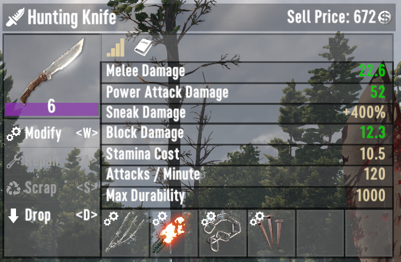
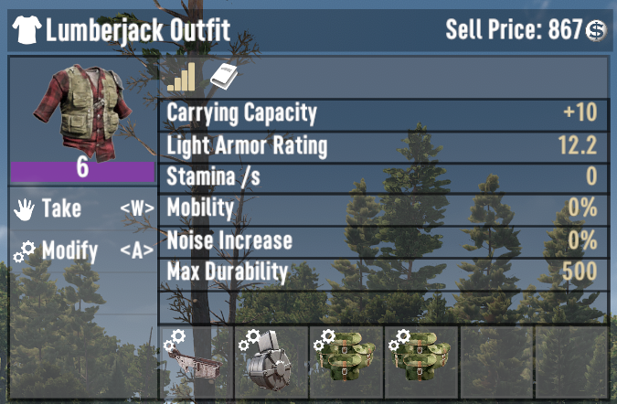
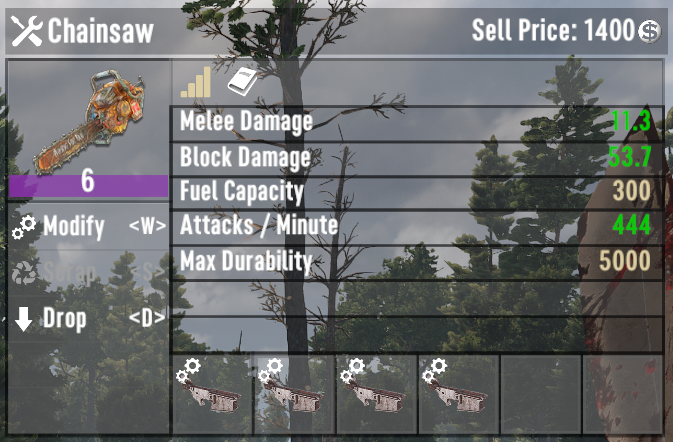
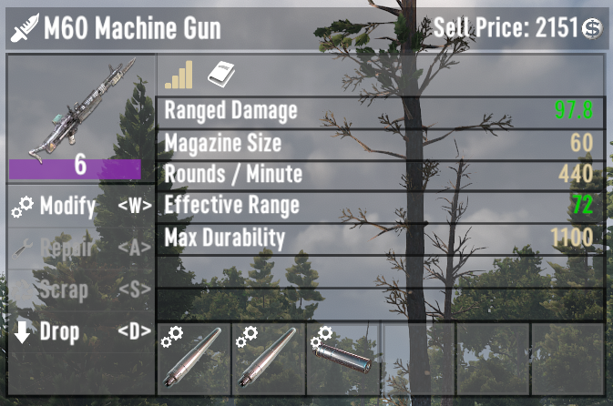

# ISI Mods Unbound

A 7 Days to Die (7D2D) mod that lets you install any mod on any thing. It also lets you stack mods and remove the restriction on installing similar mods at once allows you install similar mods at once.

Examples:

- Any Mod on Anything: Burning Shaft on a Knife, Full Auto on Armor
- Stackable Mods: Install 4 x Full Auto mods on an M60 Machine Gun... or a Chainsaw
- Mod Are No Longer Exclusionary: Using a Barrel Extender no longer prevents you from adding a Silencer.
- Install Full Auto and Drum Magazine mods in _armor_ so _every_ gun fires faster and has a larger magazine
- Stack attribute mods in the weapons or tools that need them

Please drop a comment if you find a fun combination (so others can try it out).

## Caveats

- Drone Mods Cannot Be Installed In Armor
  - Installing Drone Mods in Armor triggered Red Errors in the Console so I left those restricted. But you can now install any mod into a drone, and you can install drone mods into anything except armor.
- Stackable Mods vs Stackable Effects
  - While the game will let you stack any mod, sometimes the actual effects do not stack
  - Stacks: Full Auto Mods, Pocket Mods, Attribute Mods, etc.,
  - Does not stack: Impact Bracing Mod
- Mods with no effects
  - Some mods do not do anything if installed on something it wasn't designed for. I think this is because the effect was added to the item rather than the mod itself.
  - Example: Installing a Motor Tool Tank Mod on a Motorcycle does not increase the size of the gas tank

## My Other Mods

If you like this mod, you might like my other mods:

<https://next.nexusmods.com/profile/IronSharkInc/mods?gameId=1059>
